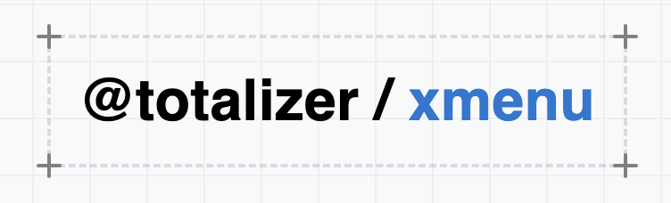
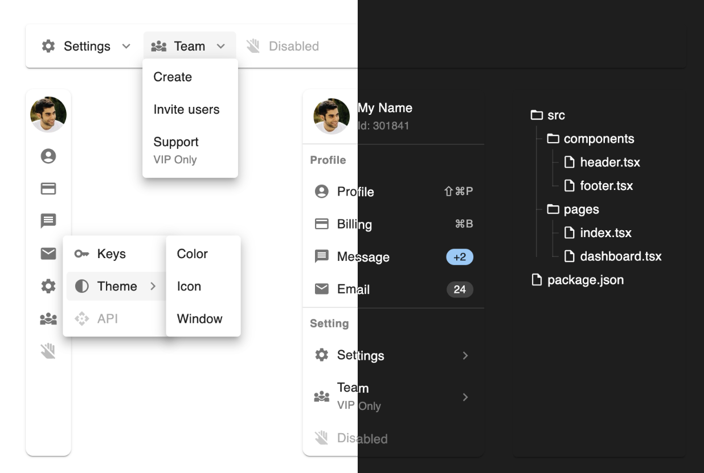

# @totalizer/xmenu

Sleek and versatile menu components, built on Material UI, are designed to elevate your Front-End experience through customizable configurations.

<p align="center"><a href="https://totalizer-x-menu.github.io/" target="_blank" rel="noopener noreferrer"></a></p>

<p align="center">
  <a href="https://www.npmjs.com/package/@totalizer/xmenu"></a>
  <a href="https://www.npmjs.com/package/@totalizer/xmenu"></a>
</p>

<p align="center">
  
</p>

## Installation

Please note that [React](https://react.dev/) and [Material UI](https://mui.com/material-ui/getting-started/installation/) are peer dependencies, meaning you should ensure they are installed before installing XMenu.

```json
"peerDependencies": {
  "@emotion/react": "^11.14.0",
  "@emotion/styled": "^11.14.0",
  "@mui/icons-material": "^6.4.3",
  "@mui/material": "^6.4.3",
  "react": "^18.3.1",
  "react-dom": "^18.3.1"
}
```

Run one of the following commands to add XMenu to your project:

```bash [npm]
npm install -S @totalizer/xmenu
```

```bash [yarn]
yarn add -S @totalizer/xmenu
```

```bash [pnpm]
pnpm add -S @totalizer/xmenu
```

## License

This project is licensed under the terms of the MIT license.
